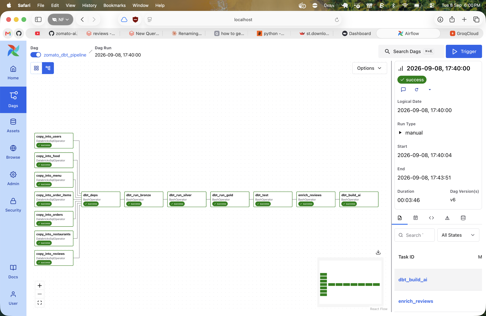
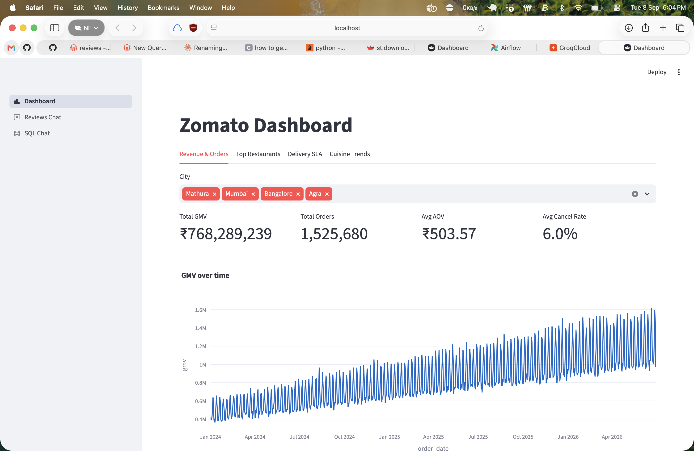
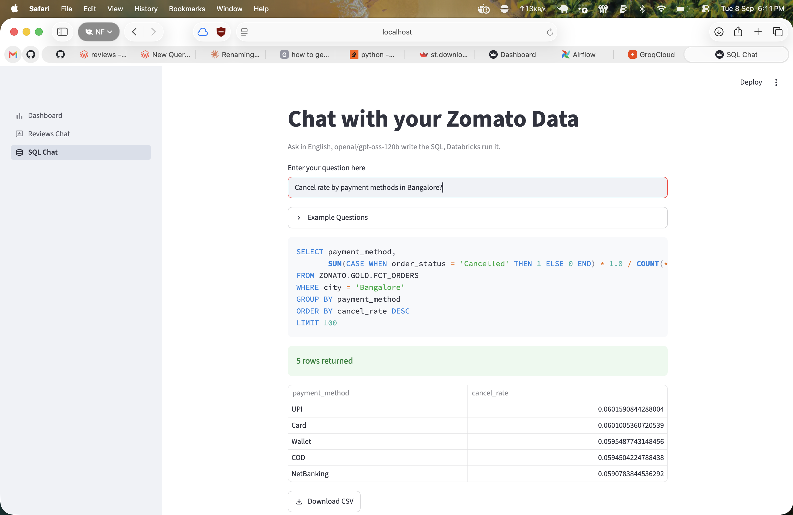

# Zomato Data Engineering Pipeline

An end-to-end data pipeline for Zomato order/restaurant/review data:
raw CSVs on S3 → Databricks (Unity Catalog) landing tables → dbt medallion
transformations (bronze/silver/gold) → orchestrated by Airflow, with an AI review-enrichment
step and a Streamlit app (chat + dashboard) on top.

```
S3 (raw CSVs)
   │  COPY INTO
   ▼
zomato.landing.*          (Databricks tables, ingested by Airflow)
   │  dbt: bronze
   ▼
zomato.bronze.*           (views — 1:1 with landing sources)
   │  dbt: silver
   ▼
zomato.silver.*           (views — typed, cleaned, deduped)
   │  dbt: gold
   ▼
zomato.gold.*              (tables — dims, facts, marts)
   │  ai/enrich_reviews.py (Groq LLM sentiment/topic classification)
   ▼
zomato.ai.review_enriched  →  dbt: mart_review_insights
```

## Demo

| Airflow DAG run | Dashboard | SQL Chat |
|---|---|---|
|  |  |  |

## Repo layout

```
.
├── zomato/                  # dbt project
│   ├── models/
│   │   ├── bronze/          # 1:1 views over landing sources
│   │   ├── silver/          # typed/cleaned views
│   │   └── gold/            # dims, facts, and marts (tables)
│   ├── macros/
│   ├── dbt_project.yml
│   └── ...
├── ai/                      # LLM-powered scripts (Groq) + Streamlit app
│   ├── config.py            # system prompts, embedding model, table schema for text-to-SQL
│   ├── connections.py       # cached Databricks SQL + Groq model connections
│   ├── enrich_reviews.py    # batch job: classifies review sentiment/topic, writes to zomato.ai.review_enriched
│   └── ui/                  # Streamlit multipage app
│       ├── app.py           # entrypoint - `streamlit run ai/ui/app.py`
│       ├── dashboard.py     # revenue, top restaurants, delivery SLA, cuisine trends (Plotly)
│       ├── reviews_chat.py  # RAG chat over customer reviews (embeddings + Groq)
│       └── sql_chat.py      # text-to-SQL chat over the gold layer
└── airflow/                  # local Airflow 3.x (Docker) that orchestrates ingestion + dbt + enrichment
    ├── Dockerfile
    ├── docker-compose.yml
    ├── dags/
    │   └── zomato_dbt_pipeline.py
    ├── dbt_profiles/
    │   └── profiles.yml     # templated, reads Databricks creds from env
    ├── include/sql/landing/ # COPY INTO statements, one per source table
    └── .env.example
```

## Data model

**Sources** (`zomato.landing`, loaded from S3 via `COPY INTO`): `food`, `users`, `menu`,
`orders`, `order_items`, `reviews`, `restaurants`.

**Bronze** (`zomato.bronze`, views) — `br_*`: a thin `select *` passthrough over each
landing source, giving every downstream layer a stable dbt `ref()` instead of depending
on raw source tables directly.

**Silver** (`zomato.silver`, views) — `sl_*`: type casting (with `try_cast` so malformed
source rows become `NULL` instead of failing the whole model), column renames, and basic
cleaning/filtering.

**Gold** (`zomato.gold`, tables):
- Dimensions: `dim_customers`, `dim_restaurants`, `dim_food`, `dim_dates`
- Facts: `fct_orders`, `fct_order_items` (incremental)
- Marts: `mart_daily_city_revenue`, `mart_delivery_sla`, `mart_restaurant_performance`,
  `mart_cuisine_trends`
- `mart_review_insights` (tagged `ai`) — joins `sl_reviews` against `zomato.ai.review_enriched`
  (written by `ai/enrich_reviews.py`) to aggregate sentiment/topic by city.

Schema placement for every layer is controlled centrally in `zomato/dbt_project.yml`
(`+schema: bronze|silver|gold`), and `zomato/macros/generate_schema_name.sql` overrides
dbt's default `<target_schema>_<custom_schema>` naming so models land in exactly
`bronze`/`silver`/`gold` rather than e.g. `landing_bronze`.

## Prerequisites

- A Databricks workspace with:
  - A SQL warehouse (for dbt + the `COPY INTO` ingestion tasks + the Streamlit app)
  - A Unity Catalog **external location** with read access to the `s3://<bucket>/raw/...`
    paths used in `airflow/include/sql/landing/*.sql` (Airflow just submits the SQL —
    Databricks needs its own S3 access configured to actually read the files)
  - A personal access token
- A [Groq](https://console.groq.com/) API key (used for review classification and the two
  chat pages in the Streamlit app)
- Docker + Docker Compose (for running Airflow locally)
- [uv](https://docs.astral.sh/uv/) (for running dbt / the Streamlit app locally, outside Airflow)

## Running dbt locally (without Airflow)

1. Create `~/.dbt/profiles.yml`:
   ```yaml
   zomato:
     target: dev
     outputs:
       dev:
         type: databricks
         catalog: zomato
         schema: landing
         host: <your-workspace-host>
         http_path: /sql/1.0/warehouses/<warehouse-id>
         token: <your-databricks-token>
         threads: 4
   ```
2. From `zomato/`:
   ```bash
   uv run dbt run     # or: dbt build, dbt run -s bronze/silver/gold, dbt test
   ```

## Running the Streamlit web app

The app lives at `ai/ui/app.py` and needs the same Databricks credentials plus a Groq API
key. It reads them from `airflow/.env` (`load_dotenv('airflow/.env')`), so set that up even
if you're not running Airflow:

```bash
cp airflow/.env.example airflow/.env   # fill in DATABRICKS_HOST/HTTP_PATH/TOKEN, GROQ_API_KEY, GROQ_MODEL_NAME
uv run streamlit run ai/ui/app.py
```

Opens at `http://localhost:8501` with three pages (sidebar nav):
- **Dashboard** (default) — revenue/orders trend, top restaurants, delivery SLA, cuisine
  trends, all pulled live from the gold marts via Plotly charts.
- **Reviews Chat** — semantic search + RAG over `sl_reviews` (embeds with
  `BAAI/bge-small-en-v1.5`, answers with Groq).
- **SQL Chat** — ask a question in English, Groq writes a `SELECT` against the gold schema
  (`ai/config.py`'s `TABLE_SCHEMA`), Airflow-independent safety check blocks anything but a
  read-only query, then it runs on Databricks and renders as a table + CSV download.

## Running the full pipeline via Airflow

```bash
cd airflow
cp .env.example .env     # fill in DATABRICKS_HOST / DATABRICKS_HTTP_PATH / DATABRICKS_TOKEN,
                          # GROQ_API_KEY / GROQ_MODEL_NAME, S3_BUCKET, and generate an AIRFLOW_JWT_SECRET
docker compose build
docker compose up -d
```

Airflow UI: http://localhost:8080 (`admin` / `admin`)

Trigger the `zomato_dbt_pipeline` DAG. It runs, in order:

1. `copy_into_food`, `copy_into_users`, `copy_into_menu`, `copy_into_orders`,
   `copy_into_order_items`, `copy_into_reviews`, `copy_into_restaurants` — in parallel,
   each landing one S3 CSV into `zomato.landing.*` via `COPY INTO`
   (`airflow/include/sql/landing/*.sql`). Idempotent — `COPY INTO` tracks which files
   it already loaded and skips them on retry.
2. `dbt_deps`
3. `dbt_run_bronze` → `dbt_run_silver` → `dbt_run_gold`
4. `dbt_test`
5. `enrich_reviews` — runs `ai/enrich_reviews.py`, which classifies a sample of
   un-enriched reviews (sentiment, topic, key issue) via Groq and writes them to
   `zomato.ai.review_enriched`.
6. `dbt_build_ai` — `dbt build --select tag:ai`, which builds `mart_review_insights` on
   top of the freshly enriched reviews.

### Configuration

All of this comes from `airflow/.env` (see `airflow/.env.example`):

| Variable | Purpose |
|---|---|
| `DATABRICKS_HOST` / `DATABRICKS_HTTP_PATH` / `DATABRICKS_TOKEN` | Databricks SQL warehouse connection, used by dbt, the `DatabricksSqlOperator` ingestion tasks, `ai/enrich_reviews.py`, and the Streamlit app |
| `DATABRICKS_CATALOG` / `DATABRICKS_SCHEMA` | dbt's default catalog/schema (per-model schema is overridden in `dbt_project.yml`) |
| `GROQ_API_KEY` / `GROQ_MODEL_NAME` | Used by `ai/connections.py` for every LLM call: review enrichment, RAG chat, and text-to-SQL |
| `S3_BUCKET` | Bucket the `COPY INTO` statements read raw CSVs from — templated into the SQL files via `{{ var.value.s3_bucket }}`, no hardcoded bucket name or manual file edits needed |
| `AIRFLOW_JWT_SECRET` | Signs Airflow 3's internal execution-API calls |

### Notes / gotchas

- **`COPY INTO` never deletes or replaces rows.** If you swap a source CSV for a smaller/
  different one at the same S3 path, the new rows get appended on top of what's already
  in the landing table — it does not "recreate" the table. If you need full-refresh
  semantics for a table, truncate it before the `COPY INTO` runs.
- dbt and `ai/enrich_reviews.py` each run from their own isolated Python venv inside the
  Airflow image (`/opt/airflow/dbt_venv`, `/opt/airflow/ai_venv`), installed via `uv`, so
  their dependencies never conflict with Airflow's own (or each other's).
- Databricks `DECIMAL` columns come back from the SQL connector as Python `Decimal` →
  pandas `dtype=object`, which breaks things like `nlargest`. The dashboard's `run_query`
  coerces numeric-looking object columns before use; keep that in mind if you add new
  Databricks-backed pandas code elsewhere.
- Credentials are never committed — `airflow/dbt_profiles/profiles.yml` and the landing
  SQL files are templated (`env_var(...)` / `{{ var.value.s3_bucket }}`); real values only
  ever live in your local `airflow/.env` (gitignored).
